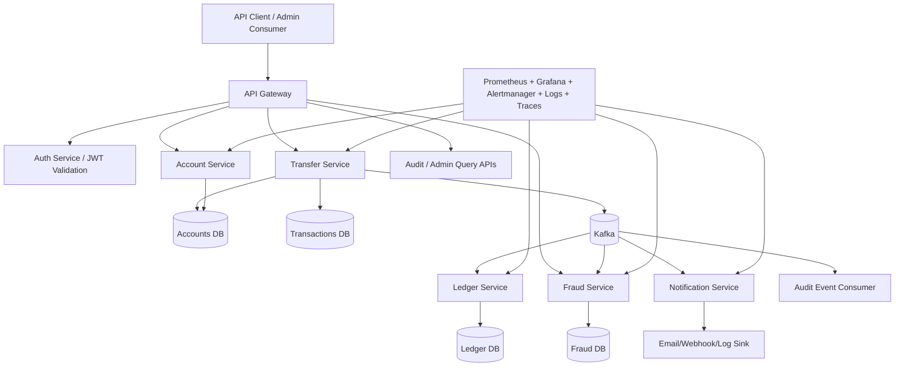

# System Design / Architecture Document
# Cloud-Native Banking Transaction System

## 1. Objective

Define a production-inspired architecture for a cloud-native banking backend that supports secure internal money movement, immutable financial records, fraud monitoring, and operational excellence.

---

## 2. Architecture Principles

- domain-driven service boundaries
- strong consistency for balance mutation
- append-only financial records
- asynchronous downstream processing
- idempotent command handling
- observable-by-default services
- infrastructure as code
- secure-by-default interfaces

---

## 3. High-Level Architecture



---

## 4. Service Catalog

## 4.1 API Gateway
Responsibilities:
- entry point for all external requests
- JWT validation / auth delegation
- rate limiting
- request routing
- correlation id propagation
- TLS termination in ingress/load balancer path

Candidate tools:
- NGINX Ingress
- Kong
- Traefik

## 4.2 Account Service
Responsibilities:
- create account
- update account profile/state
- freeze/unfreeze account
- fetch balance and status
- emit account lifecycle events

Data ownership:
- accounts
- account_status_history (optional)
- account_limits (future)

## 4.3 Transfer Service
Responsibilities:
- validate transfer requests
- enforce idempotency
- orchestrate balance mutation
- persist transaction record
- publish transfer events
- manage transfer state transitions

Data ownership:
- transactions
- idempotency records
- transfer audit metadata

## 4.4 Ledger Service
Responsibilities:
- consume transfer completion events
- generate double-entry ledger rows
- ensure append-only semantics
- expose ledger queries for auditors/admins

Data ownership:
- ledger_entries

## 4.5 Fraud Service
Responsibilities:
- consume transfer events
- apply fraud rules
- assign risk score
- persist alerts
- expose fraud alert APIs

Data ownership:
- fraud_alerts
- fraud_rule_hits

## 4.6 Notification Service
Responsibilities:
- consume business events
- send simulated user/system notifications
- format templates for transfer and alert events

Data ownership:
- notification_delivery_log

## 4.7 Audit Consumer / Admin Query Layer
Responsibilities:
- collect domain events for audit trails
- support operational review and traceability
- provide read models for administrators

---

## 5. Bounded Contexts

### Account Domain
Owns identity of bank account, state, and available balance view.

### Transfer Domain
Owns transfer command processing and transaction lifecycle.

### Ledger Domain
Owns immutable accounting representation of movements.

### Fraud Domain
Owns suspicious-pattern evaluation and alert tracking.

### Platform Domain
Owns deployment, metrics, logs, traces, alerting, and secrets.

---

## 6. Data Flow

## 6.1 Account Creation Flow
1. Client sends `POST /accounts`
2. API gateway authenticates request
3. Account service validates input
4. Account row is persisted
5. Audit metadata captured
6. Event `account.created` published

## 6.2 Transfer Completion Flow
1. Client sends `POST /transfers`
2. Transfer service checks idempotency key
3. Transfer service validates sender/receiver and account states
4. Within a DB transaction:
   - lock sender account row
   - verify funds
   - debit sender
   - credit receiver
   - create transaction row
5. Commit transaction
6. Publish `transfer.completed`
7. Ledger service consumes event and writes debit/credit entries
8. Fraud service consumes event and evaluates rules
9. Notification service consumes event and emits confirmation

## 6.3 Failed Transfer Flow
1. Validation or balance rule fails
2. Transaction record persisted as failed/rejected when needed
3. Error returned with stable error contract
4. Failure metrics incremented

---

## 7. Consistency Model

### Strong Consistency
Applied to:
- balance mutation
- transaction state creation

Mechanism:
- single transactional boundary in transfer service
- row-level locking on source account
- idempotency key deduplication

### Eventual Consistency
Applied to:
- ledger write consumption
- fraud evaluation
- notifications
- audit read models

Rationale:
These are downstream effects and should not block transfer API completion beyond the critical financial write.

---

## 8. Idempotency Strategy

Transfer initiation must be safe under retries.

Approach:
- client sends `Idempotency-Key` header
- request payload hash stored with key
- if same key + same payload already completed, return original result
- if same key + different payload, return conflict
- retention period for keys configurable, e.g. 24 hours

---

## 9. Event-Driven Design

## 9.1 Event Bus
Kafka topics recommended:

- `account.created`
- `account.updated`
- `account.frozen`
- `transfer.completed`
- `transfer.failed`
- `fraud.alert.created`
- `notification.dispatch.requested`

## 9.2 Example Event Envelope

```json
{
  "event_id": "uuid",
  "event_type": "transfer.completed",
  "occurred_at": "2026-03-17T12:00:00Z",
  "correlation_id": "uuid",
  "producer": "transfer-service",
  "payload": {}
}
```

## 9.3 Delivery Guarantees
- at-least-once delivery
- consumer idempotency required
- DLQ for poison messages
- retries with exponential backoff

---

## 10. Deployment Topology

## 10.1 Environments
- local
- dev
- staging
- prod-like demo

## 10.2 Runtime
- Docker images for each service
- Kubernetes deployments and services
- Ingress controller for external access
- ConfigMaps for non-secret config
- secrets manager / Kubernetes Secrets for credentials

## 10.3 Infrastructure via Terraform
Provision:
- VPC/network
- subnets
- security groups
- managed Kubernetes cluster or compute nodes
- managed PostgreSQL or self-hosted DB
- Kafka or compatible broker
- container registry
- monitoring storage resources

---

## 11. Security Architecture

## 11.1 Identity and Access
- JWT-based authentication
- RBAC by role claim
- service accounts for machine-to-machine access

## 11.2 Data Security
- TLS in transit
- encryption at rest handled by provider or DB settings
- no secrets in code or image
- secret rotation supported by environment variables/secret store

## 11.3 Application Security
- input validation
- rate limiting
- audit logging
- dependency scanning in CI
- image scanning in CI/CD

---

## 12. Observability Architecture

## Metrics
Per service:
- request count
- request duration
- error count
- business counters:
  - transfers completed
  - transfers failed
  - fraud alerts created

## Logs
- structured JSON logs
- correlation id in every log line
- log levels: info, warning, error

## Tracing
- OpenTelemetry instrumentation
- trace propagation across gateway, transfer, ledger, fraud, notification

## Alerts
- service unavailable
- high 5xx rate
- p95 latency breach
- message consumer lag
- fraud alert spike

---

## 13. Failure Scenarios and Handling

### Scenario A — Duplicate client retries
Handled by idempotency key store and request hash comparison.

### Scenario B — Insufficient funds race condition
Handled by DB transaction and row lock on sender account.

### Scenario C — Kafka consumer failure
Handled by retries, offsets, DLQ, and alerting on consumer lag.

### Scenario D — Ledger service temporary outage
Transfer remains completed; ledger catch-up occurs once service resumes.
Operational alert is fired.

### Scenario E — Partial infrastructure deployment failure
Handled by Terraform plan/apply visibility and CI/CD stage gating.

---

## 14. Scalability Strategy

- stateless service pods scale horizontally
- DB connection pooling per service
- read paths can add cache/replica later
- Kafka partitions increase consumer throughput
- fraud service can scale separately from account service

---

## 15. Trade-Offs

### Chosen
- microservices with Kafka + Postgres

### Why
- best balance between realism and implementation value
- separates critical write path from downstream concerns
- strong recruiter signal

### Not Chosen for MVP
- full event sourcing
- CQRS everywhere
- service mesh from day one

### Why Not
- adds complexity beyond MVP demonstration value

---

## 16. Recommended Repository Structure

```text
banking-system/
├── services/
│   ├── account-service/
│   ├── transfer-service/
│   ├── ledger-service/
│   ├── fraud-service/
│   ├── notification-service/
│   └── gateway/
├── shared/
│   ├── auth/
│   ├── events/
│   ├── observability/
│   └── utils/
├── infra/
│   ├── terraform/
│   ├── kubernetes/
│   ├── monitoring/
│   └── docker-compose/
├── tests/
│   ├── integration/
│   ├── contract/
│   └── e2e/
└── docs/
```

---

## 17. Recommended Technology Stack

- **Language:** Python (FastAPI)
- **Databases:** PostgreSQL, Redis
- **Messaging:** Kafka
- **Containerization:** Docker
- **Orchestration:** Kubernetes
- **IaC:** Terraform
- **CI/CD:** GitHub Actions
- **Observability:** Prometheus, Grafana, Alertmanager, OpenTelemetry
- **Testing:** Pytest, Testcontainers, k6 for load tests

---

## 18. Architecture Decision Summary

This architecture intentionally models the most important properties of transaction-heavy systems:

- correctness before convenience
- append-only financial records
- retry safety
- clear ownership boundaries
- operational observability
- scalable deployment patterns

That makes it appropriate as a serious portfolio representation of modern fintech backend design.
