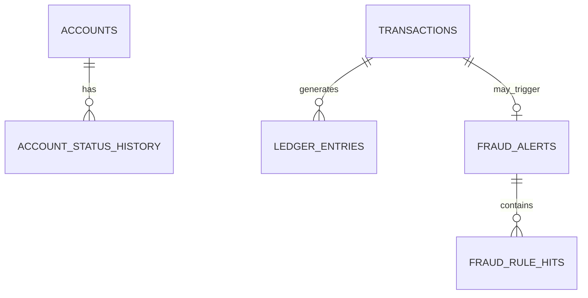

# Database Schema
# Cloud-Native Banking Transaction System

## 1. Data Modeling Principles

- each service owns its persistence boundary
- transfer-critical writes must be strongly consistent
- ledger must be append-only
- all write models should be audit-friendly
- public identifiers should use UUIDs
- timestamps should be stored in UTC
- status fields should use explicit enums
- monetary values should use fixed precision, not floating point

---

## 2. Data Storage Overview

| Service | Primary Store | Purpose |
|---|---|---|
| Account Service | PostgreSQL | account state and balances |
| Transfer Service | PostgreSQL | transaction lifecycle and idempotency |
| Ledger Service | PostgreSQL | immutable ledger entries |
| Fraud Service | PostgreSQL | alerts, rule hits, reviews |
| Notification Service | PostgreSQL or lightweight store | delivery logs |
| Shared Infra | Redis | caching / short-lived dedup / rate limit support |
| Messaging | Kafka | domain events |

---

## 3. Account Service Schema

## 3.1 `accounts`

```sql
CREATE TABLE accounts (
    account_id UUID PRIMARY KEY,
    external_customer_id VARCHAR(64) NOT NULL,
    account_number VARCHAR(32) NOT NULL UNIQUE,
    full_name VARCHAR(150) NOT NULL,
    email VARCHAR(255),
    phone VARCHAR(32),
    currency CHAR(3) NOT NULL DEFAULT 'USD',
    balance NUMERIC(18,2) NOT NULL DEFAULT 0.00,
    available_balance NUMERIC(18,2) NOT NULL DEFAULT 0.00,
    status VARCHAR(20) NOT NULL,
    created_at TIMESTAMPTZ NOT NULL DEFAULT NOW(),
    updated_at TIMESTAMPTZ NOT NULL DEFAULT NOW(),
    created_by VARCHAR(64) NOT NULL,
    updated_by VARCHAR(64) NOT NULL
);
```

### Notes
- `balance` and `available_balance` are both included to support future reserved-funds logic.
- `status` values:
  - `PENDING`
  - `ACTIVE`
  - `FROZEN`
  - `CLOSED`

### Indexes
```sql
CREATE UNIQUE INDEX idx_accounts_external_customer_id
ON accounts (external_customer_id);

CREATE INDEX idx_accounts_status
ON accounts (status);

CREATE INDEX idx_accounts_email
ON accounts (email);
```

---

## 3.2 `account_status_history`

```sql
CREATE TABLE account_status_history (
    history_id UUID PRIMARY KEY,
    account_id UUID NOT NULL REFERENCES accounts(account_id),
    old_status VARCHAR(20),
    new_status VARCHAR(20) NOT NULL,
    reason VARCHAR(255),
    changed_by VARCHAR(64) NOT NULL,
    changed_at TIMESTAMPTZ NOT NULL DEFAULT NOW()
);
```

Purpose:
- audit state changes such as freeze/unfreeze

---

## 4. Transfer Service Schema

## 4.1 `transactions`

```sql
CREATE TABLE transactions (
    transaction_id UUID PRIMARY KEY,
    transaction_reference VARCHAR(40) NOT NULL UNIQUE,
    idempotency_key VARCHAR(128) NOT NULL,
    sender_account_id UUID NOT NULL,
    receiver_account_id UUID NOT NULL,
    currency CHAR(3) NOT NULL,
    amount NUMERIC(18,2) NOT NULL,
    status VARCHAR(20) NOT NULL,
    failure_code VARCHAR(64),
    failure_reason VARCHAR(255),
    requested_at TIMESTAMPTZ NOT NULL DEFAULT NOW(),
    processed_at TIMESTAMPTZ,
    correlation_id UUID NOT NULL,
    initiated_by VARCHAR(64) NOT NULL,
    request_hash VARCHAR(128) NOT NULL
);
```

### Status Values
- `PENDING`
- `COMPLETED`
- `FAILED`
- `REJECTED`

### Indexes
```sql
CREATE UNIQUE INDEX idx_transactions_idempotency_key
ON transactions (idempotency_key);

CREATE INDEX idx_transactions_sender_account_id
ON transactions (sender_account_id);

CREATE INDEX idx_transactions_receiver_account_id
ON transactions (receiver_account_id);

CREATE INDEX idx_transactions_status
ON transactions (status);

CREATE INDEX idx_transactions_requested_at
ON transactions (requested_at DESC);
```

### Business Rules
- same `idempotency_key` must not produce multiple financial effects
- `sender_account_id != receiver_account_id`
- amount > 0

---

## 4.2 `idempotency_records`

```sql
CREATE TABLE idempotency_records (
    idempotency_key VARCHAR(128) PRIMARY KEY,
    request_hash VARCHAR(128) NOT NULL,
    transaction_id UUID,
    response_code INT,
    response_body JSONB,
    status VARCHAR(20) NOT NULL,
    created_at TIMESTAMPTZ NOT NULL DEFAULT NOW(),
    expires_at TIMESTAMPTZ NOT NULL
);
```

Purpose:
- stable retry handling
- replay of original response for safe client retries

### Index
```sql
CREATE INDEX idx_idempotency_expires_at
ON idempotency_records (expires_at);
```

---

## 5. Ledger Service Schema

## 5.1 `ledger_entries`

```sql
CREATE TABLE ledger_entries (
    ledger_entry_id UUID PRIMARY KEY,
    transaction_id UUID NOT NULL,
    entry_sequence INT NOT NULL,
    account_id UUID NOT NULL,
    entry_type VARCHAR(10) NOT NULL,
    currency CHAR(3) NOT NULL,
    amount NUMERIC(18,2) NOT NULL,
    running_balance NUMERIC(18,2),
    occurred_at TIMESTAMPTZ NOT NULL,
    created_at TIMESTAMPTZ NOT NULL DEFAULT NOW(),
    correlation_id UUID NOT NULL
);
```

### Constraints
```sql
ALTER TABLE ledger_entries
ADD CONSTRAINT chk_ledger_entry_type
CHECK (entry_type IN ('DEBIT', 'CREDIT'));

ALTER TABLE ledger_entries
ADD CONSTRAINT uq_ledger_tx_seq
UNIQUE (transaction_id, entry_sequence);
```

### Indexes
```sql
CREATE INDEX idx_ledger_transaction_id
ON ledger_entries (transaction_id);

CREATE INDEX idx_ledger_account_id_occurred_at
ON ledger_entries (account_id, occurred_at DESC);
```

### Ledger Semantics
For every completed transfer:
- one `DEBIT` entry for sender
- one `CREDIT` entry for receiver

No update or delete path is exposed through application APIs.

---

## 6. Fraud Service Schema

## 6.1 `fraud_alerts`

```sql
CREATE TABLE fraud_alerts (
    alert_id UUID PRIMARY KEY,
    transaction_id UUID NOT NULL,
    account_id UUID,
    risk_score NUMERIC(5,2) NOT NULL,
    severity VARCHAR(20) NOT NULL,
    status VARCHAR(20) NOT NULL,
    primary_reason VARCHAR(255) NOT NULL,
    created_at TIMESTAMPTZ NOT NULL DEFAULT NOW(),
    reviewed_at TIMESTAMPTZ,
    reviewed_by VARCHAR(64)
);
```

### Values
- severity:
  - `LOW`
  - `MEDIUM`
  - `HIGH`
  - `CRITICAL`

- status:
  - `OPEN`
  - `UNDER_REVIEW`
  - `DISMISSED`
  - `CONFIRMED`

### Indexes
```sql
CREATE INDEX idx_fraud_alerts_transaction_id
ON fraud_alerts (transaction_id);

CREATE INDEX idx_fraud_alerts_status
ON fraud_alerts (status);

CREATE INDEX idx_fraud_alerts_created_at
ON fraud_alerts (created_at DESC);
```

---

## 6.2 `fraud_rule_hits`

```sql
CREATE TABLE fraud_rule_hits (
    hit_id UUID PRIMARY KEY,
    alert_id UUID NOT NULL REFERENCES fraud_alerts(alert_id),
    rule_code VARCHAR(64) NOT NULL,
    rule_name VARCHAR(150) NOT NULL,
    score_contribution NUMERIC(5,2) NOT NULL,
    details JSONB,
    created_at TIMESTAMPTZ NOT NULL DEFAULT NOW()
);
```

Purpose:
- explainability for fraud decisions

---

## 7. Notification Service Schema

## 7.1 `notification_delivery_log`

```sql
CREATE TABLE notification_delivery_log (
    notification_id UUID PRIMARY KEY,
    event_id UUID NOT NULL,
    channel VARCHAR(20) NOT NULL,
    recipient VARCHAR(255) NOT NULL,
    template_code VARCHAR(64) NOT NULL,
    delivery_status VARCHAR(20) NOT NULL,
    provider_reference VARCHAR(128),
    error_message VARCHAR(255),
    sent_at TIMESTAMPTZ,
    created_at TIMESTAMPTZ NOT NULL DEFAULT NOW()
);
```

### Values
- channel:
  - `EMAIL`
  - `SMS`
  - `WEBHOOK`
  - `LOG`

- delivery_status:
  - `PENDING`
  - `SENT`
  - `FAILED`

---

## 8. Audit Model

## 8.1 `audit_log`

This table may live in a shared audit store or dedicated service.

```sql
CREATE TABLE audit_log (
    audit_id UUID PRIMARY KEY,
    actor_id VARCHAR(64) NOT NULL,
    actor_role VARCHAR(64) NOT NULL,
    action VARCHAR(100) NOT NULL,
    entity_type VARCHAR(50) NOT NULL,
    entity_id VARCHAR(64) NOT NULL,
    correlation_id UUID NOT NULL,
    metadata JSONB,
    created_at TIMESTAMPTZ NOT NULL DEFAULT NOW()
);
```

Purpose:
- operational traceability
- admin and auditor query support

---

## 9. Redis Usage

Redis is optional but useful for:
- rate limiting counters
- token/session cache
- ephemeral deduplication
- short-lived read cache for account summaries

Not a source of truth for financial state.

---

## 10. Kafka Topics and Payload Pointers

### Topic: `transfer.completed`
Key:
- `transaction_id`

Payload fields:
- transaction_id
- sender_account_id
- receiver_account_id
- amount
- currency
- occurred_at
- correlation_id

### Topic: `fraud.alert.created`
Key:
- `alert_id`

Payload fields:
- alert_id
- transaction_id
- severity
- risk_score
- primary_reason
- occurred_at

---

## 11. Entity Relationship Summary



---

## 12. Data Retention Strategy

- accounts: retained for full system life
- transactions: retained for full system life
- ledger_entries: retained permanently for demo integrity
- fraud_alerts: retained for full system life
- idempotency_records: TTL cleanup after configured retention
- notification logs: retained short-to-medium term
- audit logs: retained long term

---

## 13. Schema Evolution Guidance

- use additive changes first
- avoid destructive migrations in early releases
- version event schemas if payloads evolve
- treat financial tables as high-control migration targets
- require migration validation in CI/CD

---

## 14. Recommended Migration Tooling

- Alembic for Python/FastAPI stack
- one migration directory per service
- migration checks in CI
- repeatable seed scripts for local demo data
